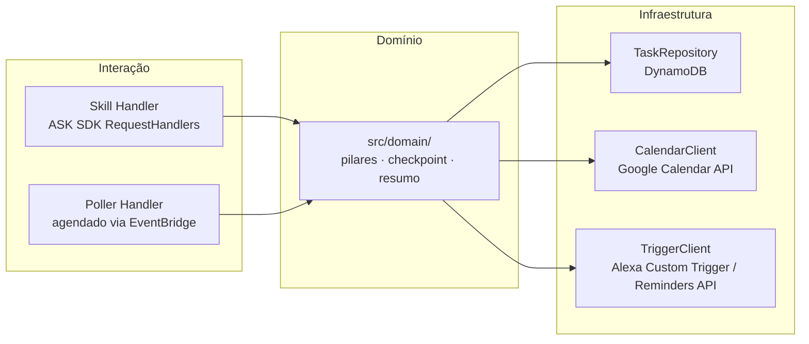
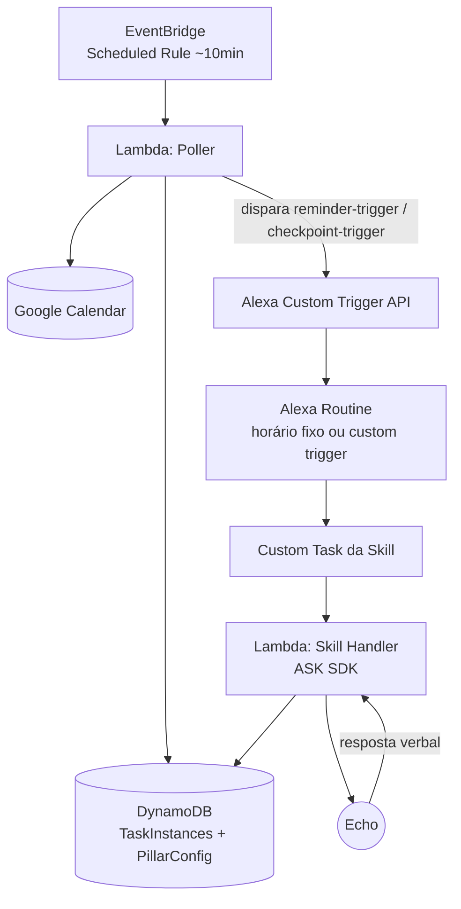
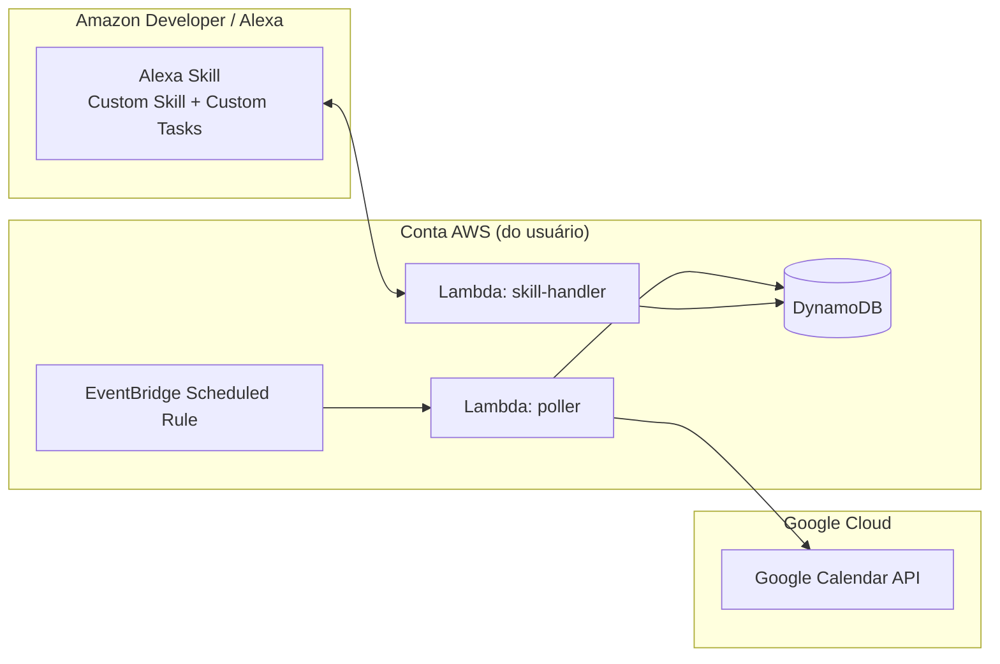
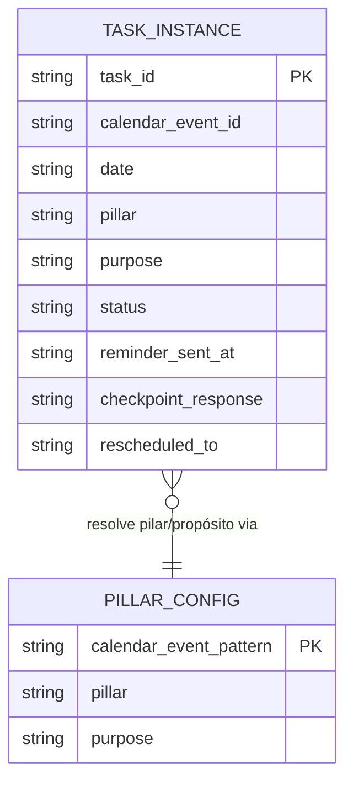

# Architecture Spine — Assistente de Produtividade Pessoal com Alexa

## Design Paradigm

**Hexagonal leve (Ports & Adapters).** Três camadas:

- **Domínio** (`src/domain/`) — regras de pilar/propósito, máquina de estado do checkpoint, cálculo do resumo semanal. Puro TypeScript/JavaScript, sem import de `aws-sdk`, `ask-sdk-core` ou `googleapis`.
- **Interação** — dois adaptadores de entrada independentes que chamam o domínio: os `RequestHandlers` do ASK SDK (sessão de voz) e o handler do Lambda de polling (agendado).
- **Infraestrutura** — adaptadores de saída que o domínio invoca via interface: repositório DynamoDB, cliente Google Calendar API, cliente Alexa Trigger/Reminders API.

A restrição de plataforma que molda tudo isso: uma Skill customizada não pode abrir sessão de voz proativamente — só falar uma vez (Reminders API) ou notificar (Proactive Events API). O mecanismo viável para o checkpoint com diálogo real (pergunta → espera → retry) é uma **Alexa Routine disparando uma Custom Task** da Skill, que aí sim abre uma sessão completa. Rotinas de horário fixo (resumo semanal) disparam a Custom Task direto; rotinas de horário dinâmico (lembrete/checkpoint por tarefa) usam **Custom Triggers for Routines**, acionados programaticamente pelo Poller.

## Invariants & Rules

### AD-1 — Domínio isolado de infraestrutura

- **Binds:** todo o código em `src/domain/`
- **Prevents:** lógica de negócio duplicada ou divergente entre o handler da Skill e o Poller
- **Rule:** `src/domain/` nunca importa `aws-sdk`, `ask-sdk-core` ou `googleapis`. Toda comunicação com o mundo externo passa por uma interface (`TaskRepository`, `CalendarClient`, `TriggerClient`) implementada em `src/infra/`.

### AD-2 — Dois entrypoints, um domínio só

- **Binds:** `src/handlers/skill.ts`, `src/handlers/poller.ts`
- **Prevents:** os dois Lambdas implementarem a mesma regra (ex.: janela de retry do checkpoint) de formas incompatíveis
- **Rule:** os dois handlers só orquestram — chamam funções de `src/domain/`, nunca reimplementam regra localmente.

### AD-3 — DynamoDB como fonte única de verdade do estado de tarefa

- **Binds:** FR-3, FR-4, FR-5, FR-9
- **Prevents:** estado assumido em memória entre invocações (Lambda é stateless); escritas conflitantes entre Poller e Skill handler
- **Rule:** um item por instância de tarefa (`task_id` = `{calendar_event_id}#{date}`) na tabela `TaskInstances`. Campo `status` transiciona só por esses valores, nessa ordem: `pendente` → `lembrete_enviado` → `aguardando_checkpoint` → `respondido` | `sem_resposta` | `reagendado`. Toda transição passa por uma função de domínio (`transitionTaskStatus`) — nenhum adaptador escreve o campo `status` diretamente.

### AD-4 — Contrato fixo dos Custom Triggers

- **Binds:** FR-1, FR-3, Poller, setup de Rotinas na Alexa
- **Prevents:** nomes de trigger inconsistentes entre o que o Poller dispara e o que está registrado nas Rotinas do usuário
- **Rule:** exatamente duas fontes de trigger, pré-registradas: `reminder-trigger` e `checkpoint-trigger`. Payload fixo: `{ task_id, pillar, purpose, calendar_event_id }`. O resumo semanal (FR-7/FR-8/FR-12) não usa Custom Trigger — vai direto por Rotinas de horário fixo apontando pra sua própria Custom Task.

### AD-5 — Config de pilar/propósito é dado, não código

- **Binds:** FR-11
- **Prevents:** alterar a associação evento↔pilar exigir redeploy do Lambda
- **Rule:** mapeamento vive na tabela `PillarConfig` (DynamoDB), editada fora da aplicação (AWS CLI/console). Nenhum caminho de código nos Lambdas escreve nessa tabela na v1 — é somente leitura do ponto de vista da aplicação, condizente com FR-11 (sem comando de voz nem interface de configuração).

### AD-6 — Credenciais nunca passam pela sessão de implementação

- **Binds:** todo o deploy
- **Prevents:** segredos AWS/Google commitados no repo ou solicitados nesta sessão de implementação
- **Rule:** infraestrutura inteira definida via AWS SAM (`template.yaml`). O deploy roda localmente, com as credenciais AWS do próprio usuário (`sam deploy --guided`) — nunca com credenciais fornecidas à sessão que escreve o código.



## Consistency Conventions

| Concern | Convention |
| --- | --- |
| Naming (entidades, arquivos, eventos) | `PascalCase` para tipos de domínio (`TaskInstance`, `PillarConfig`); `camelCase` para funções; nomes de trigger em `kebab-case` fixos (AD-4) |
| Dados & formatos | Datas em ISO 8601 UTC; `task_id` sempre `{calendar_event_id}#{YYYY-MM-DD}`; erros de adaptador convertidos para um tipo `DomainError` antes de cruzar pro domínio — domínio nunca vê exceção nativa da AWS SDK ou do Google API |
| Estado & cross-cutting | Mutação de estado só via `transitionTaskStatus` (AD-3); logging estruturado (JSON) em todo handler; config sensível (API keys) via variáveis de ambiente do Lambda, nunca hardcoded |

## Stack

| Name | Version |
| --- | --- |
| AWS Lambda (runtime) | nodejs24.x |
| Node.js | 24.x LTS |
| ask-sdk-core | ^2.14.0 |
| ask-sdk-model | ^1.x (peer dependency do ask-sdk-core) |
| AWS SDK for JavaScript | v3 (`@aws-sdk/client-dynamodb`) |
| googleapis (Node client) | latest — verificar versão exata na implementação |
| AWS SAM CLI | latest (deploy via `sam deploy --guided`) |
| Amazon DynamoDB | — (serviço gerenciado) |
| Amazon EventBridge (Scheduled Rule) | — (serviço gerenciado, dispara o Poller) |

## Structural Seed

### Contêineres e fluxo



### Deployment & Environments

Ambiente único (v1 hobby — sem staging separado). Tudo numa única conta AWS, região única (`us-east-1`, exigida pela maioria dos endpoints da Alexa Skills Kit — confirmar na implementação).



**[ASSUMPTION: conta AWS e credenciais Google Calendar API partem do zero — provisionamento inicial (criar conta, ativar API, gerar OAuth client) faz parte do primeiro slice de implementação, não é um pré-requisito externo já resolvido.]**

### Core-entity ERD



### Source tree

```text
{root}/
  template.yaml          # AWS SAM - define Lambdas, DynamoDB, EventBridge Rule, IAM
  src/
    domain/               # regras puras - pilares, checkpoint, resumo semanal (AD-1)
      taskState.ts
      weeklySummary.ts
      pillarPurpose.ts
    handlers/
      skill.ts             # entrypoint ASK SDK - RequestHandlers (AD-2)
      poller.ts             # entrypoint agendado (AD-2)
    infra/
      dynamoTaskRepository.ts
      googleCalendarClient.ts
      alexaTriggerClient.ts
  test/
    domain/               # testes do domínio, sem mocks de AWS/Alexa
```

## Capability → Architecture Map

| Capability / Área | Vive em | Governado por |
| --- | --- | --- |
| FR-1 (lembrete no horário) | Poller → `reminder-trigger` → Custom Task | AD-3, AD-4 |
| FR-2 (reconexão com propósito) | `src/domain/pillarPurpose.ts` | AD-1 |
| FR-3/FR-4 (checkpoint + retry único) | Skill Handler, sessão ASK SDK | AD-2, AD-3 |
| FR-5 (registro da resposta) | `TaskInstance.status`, `checkpoint_response` | AD-3 |
| FR-6 (reagendamento) | `src/domain/taskState.ts` | AD-1, AD-3 |
| FR-7/FR-8/FR-12 (resumo semanal, fixo e sob demanda) | Rotina de horário fixo → Custom Task; `src/domain/weeklySummary.ts` | AD-4 |
| FR-9/FR-10 (conteúdo e fechamento do resumo) | `src/domain/weeklySummary.ts` | AD-1 |
| FR-11 (config de pilar/propósito) | Tabela `PillarConfig` | AD-5 |
| NFR-1 (custo free tier) | Stack inteira (Lambda + DynamoDB + EventBridge — todos com free tier generoso) | Stack |
| NFR-2 (limitações de sincronização do Calendar) | Poller (intervalo de polling) | AD-4 |
| NFR-3 (tom de voz) | `src/domain/` — texto das falas centralizado, nunca hardcoded nos handlers | AD-1 |

## Deferred

- **Intervalo exato do polling** (ex.: 10 min vs 15 min) — ajustar na implementação junto com o orçamento de free tier do EventBridge/Lambda; não muda nenhum AD.
- **Região AWS exata** — provavelmente `us-east-1`, confirmar contra os endpoints atuais da Alexa Skills Kit na implementação.
- **Versão exata do cliente `googleapis`** — fixar no momento do `npm install`.
- **Diretivas de Custom Task no `ask-sdk-core` 2.14.0** — se o SDK não tiver builder tipado pra Custom Task/Dialog (SDK sem release recente), construir o JSON da diretiva manualmente; não afeta a arquitetura, é detalhe de implementação.
- **Estratégia de teste de integração** (como testar o fluxo Rotina → Custom Trigger → Skill sem um dispositivo Echo físico) — não decidido; provavelmente mock manual durante o build.
- **Apoio durante a execução da tarefa (mid-task)** e **configuração de pilar por voz** — fora de escopo da v1 por decisão do PRD; não têm arquitetura aqui.
